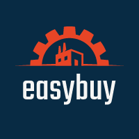
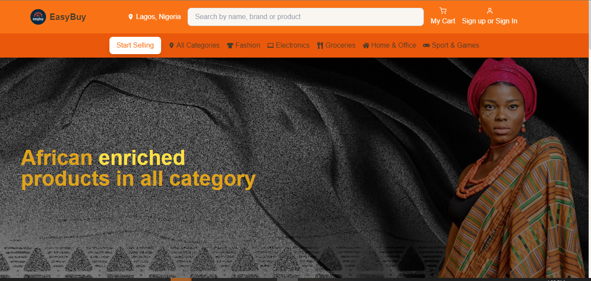

# **EasyBuy Ecommerce Platform**

Welcome to **EasyBuy**, an advanced e-commerce platform designed for buying and selling electronics, fashion items, and more. This project is built using **Next.js** and **Firebase** to provide seamless shopping experience. Below you'll find all the details you need to get started, contribute, and explore all the features of the platform.



## 🚀 **Live Demo**
Check out the live version of the website:
[**EasyBuy Live**](https://easybuy-rho.vercel.app/)

## **Table of Contents**
- [Project Overview](#project-overview)
- [Features](#features)
- [Technologies](#technologies)
- [Installation](#installation)
- [Folder Structure](#folder-structure)
- [Authentication](#authentication)
- [Routes and Pages](#routes-and-pages)
- [Contributing](#contributing)
- [License](#license)

## **Project Overview**
**EasyBuy** is an e-commerce website where users can browse and purchase a variety of electronics and fashion items. With an intuitive design, users can easily find the products they need, view product details, and add them to their cart. The project includes:
- **Electronics Page**: Displays products like motherboards, cameras, and drum kits.
- **Fashion Page**: Displays fashion items like shoes, bags, and more.
- **User Authentication**: Sign up or log in using email or Google, powered by Firebase Authentication.
- **Product Tabs**: View product information, specifications, reviews, and seller information.
- **User Dashboard**: Access orders, reviews, and other account-related features after login.

## **Features**
1. **Beautiful Product Pages**:
   - Custom-designed fashion and electronics product pages.
   - Responsive and optimized images for a fast-loading user experience.
   - Hover effects and subtle transitions for enhanced user interaction.

2. **Firebase Authentication**:
   - Email/Password Sign-In and Sign-Up.
   - Google Authentication integration.
   - Conditional rendering of `Sign up/Sign in` or `Logout` based on the authentication state.

3. **Shopping Cart**:
   - Add products to the cart and view them in the cart section.
   - Smooth checkout process (currently under development).

4. **User Dashboard**:
   - A personalized dashboard where users can manage their products, orders, reviews, and favorites.

5. **Tabs for Detailed Product Information**:
   - Tabs for viewing product information, specifications, reviews, and delivery details.

6. **Mobile-Responsive Design**:
   - Works beautifully on both mobile and desktop, offering users a consistent experience across devices.

## **Technologies**
This project leverages the following technologies:

- **Next.js**: React framework for server-side rendering and generating static websites.
- **Firebase**: Used for authentication and session management.
- **Tailwind CSS**: A utility-first CSS framework for fast styling.
- **Vercel**: Platform for front-end deployment.
- **React Icons**: For beautiful, customizable icons throughout the platform.
- **Axios**: For handling API requests, specifically for authentication.

## **Installation**

To run this project locally, follow the steps below:

1. **Clone the repository**:
   ```bash
   git clone https://github.com/yourusername/easybuy.git
   cd easybuy
   ```

2. **Install dependencies**:
   Make sure you have Node.js and npm/yarn installed.
   ```bash
   npm install
   # or
   yarn install
   ```

3. **Set up Firebase**:
   - Create a Firebase project and add your web app.
   - Obtain the Firebase configuration and set it in your environment file (`.env.local`).
   
   Example:
   ```
   NEXT_PUBLIC_FIREBASE_API_KEY=your-api-key
   NEXT_PUBLIC_FIREBASE_AUTH_DOMAIN=your-auth-domain
   NEXT_PUBLIC_FIREBASE_PROJECT_ID=your-project-id
   NEXT_PUBLIC_FIREBASE_STORAGE_BUCKET=your-storage-bucket
   NEXT_PUBLIC_FIREBASE_MESSAGING_SENDER_ID=your-messaging-sender-id
   NEXT_PUBLIC_FIREBASE_APP_ID=your-app-id
   ```

4. **Run the development server**:
   ```bash
   npm run dev
   ```

   Now, open [http://localhost:3000](http://localhost:3000) to view the application in the browser.

## **Folder Structure**
Here’s a breakdown of the folder structure:

```
/app
  /electronics
    /[id]
      page.js         # Product details for each electronic item
    page.js           # Electronics page
  /fashion
    /[id]
      page.js         # Product details for fashion items
    page.js           # Fashion page
/components
  /Header.js          # Site header with conditional auth state
  /ProductTabs.js     # Product tabs (Information, Reviews, etc.)
  /DashboardLayout.js # Layout for the user dashboard
/lib
  /firebaseAuth.js    # Firebase authentication setup
/public
  /images             # Static images for the project
  /styles             # Tailwind CSS and global styles
```

## **Authentication**
We use Firebase for authentication. To sign up or sign in, users can:
- Use their email and password.
- Sign in with their Google account via Firebase Authentication.

Once logged in, the `Logout` button appears, replacing the `Sign up/Sign in` option. The user's session is maintained using Firebase's session management.

## **Routes and Pages**

### Key Routes:
- **/electronics**: Displays all electronics products.
- **/fashion**: Displays all fashion products.
- **/dashboard**: Shows user-specific features like orders, reviews, and favorites.
- **/mycart**: Shows the products added to the cart.
- **/signup**: Page for users to sign up or log in.

## **Contributing**

We welcome contributions to the project! If you’d like to contribute:

1. Fork the repository.
2. Create a new branch.
3. Commit your changes.
4. Open a pull request.

Before making large changes, it’s a good idea to open an issue for discussion.

## **License**
This project is licensed under the MIT License. You can freely use, modify, and distribute the project.

---

Thank you for checking out **EasyBuy**! We hope you enjoy the experience. If you have any feedback or issues, feel free to open an issue or reach out.

